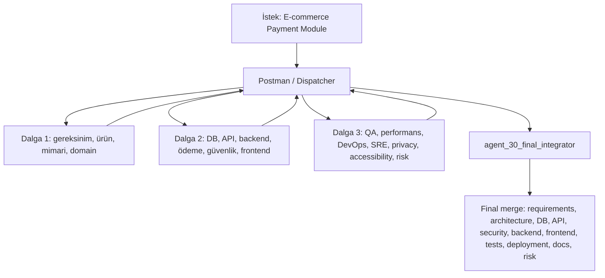
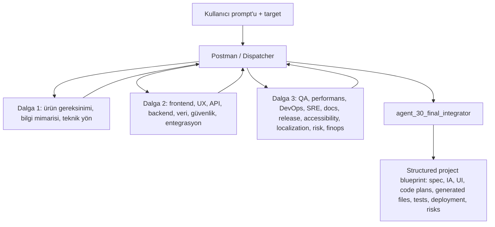

# 30 Bağımsız AI Ajan Orkestrasyon Prototipi

Bu depo, FastAPI ve Python 3.11+ ile yazılmış 30 tamamen bağımsız yazılım geliştirme ajanı prototipidir. Tasarımın ana fikri: ajanlar birbirini bilmez, ana repoya doğrudan erişmez, paylaşılan bellek kullanmaz ve yalnızca Postman/Dispatcher tarafından kendilerine verilen minimal JSON görev paketiyle çalışır.

## Mimari kurallar

- **30 bağımsız uzman ajan:** `app/prompts.py` içinde tam olarak 30 ajan prompt'u vardır. Roller; gereksinim analisti, sistem mimarı, veritabanı mimarı, API tasarımcısı, güvenlik denetçisi, React uzmanı, backend uzmanı, ödeme entegrasyon uzmanı, QA mühendisi, DevOps uzmanı, dokümantasyon uzmanı ve diğer uzmanlıkları kapsar.
- **Execution Independence:** Her `IndependentAgent`, `asyncio.create_subprocess_exec` ile ayrı Python süreci başlatır. Timeout veya crash sadece o ajanın `AgentOutput` sonucunu `failed/timed_out` yapar; diğer ajan süreçleri etkilenmez.
- **Contextual Independence:** `Dispatcher`, her ajan için sadece role gerekli `minimal_context` üretir. Tüm proje, ham önceki çıktılar veya diğer ajanların belleği gönderilmez.
- **Infrastructure Independence:** Her ajan ayrı `ProviderConfig` kullanır: `provider`, `model`, `api_key_env`. Örnek sağlayıcılar GPT, Claude, Gemini, Azure OpenAI ve local Llama olarak döndürülür. Secret değerleri hardcode edilmez; sadece env var adları tutulur.
- **Zero-Shared State:** Ajanlar ortak bellek kullanmaz. Sadece input JSON alır, sandbox içinde artifact yazar ve JSON çıktı döndürür.
- **Postman / Orchestrator:** Ajanlar birbirini tanımaz. Bir ajan bitince çıktısı Postman tarafından anonimleştirilmiş, daraltılmış yeni input paketlerine dönüştürülür.
- **Sandbox Environment:** `SandboxManager`, her run/ajan için sistem temp altında ayrı sanal çalışma dizini oluşturur. Ajan worker'ı çıktı yolunun sandbox içinde olduğunu doğrular; ana repo dizinine doğrudan yazmaz.
- **Standart interface:** Kodda standart sözleşme `Agent.run(independent_task_package)` olarak `Protocol` ile görünürdür. Uygulama sınıfı `IndependentAgent.run(...)` aynı arayüzü uygular.
- **Error Handling:** Başarısız ajan yalnızca orkestratöre hata döndürür. Dispatcher aynı ajanı retry eder; diğer ajanlara bu hata bildirilmez.

## Proje yapısı

```text
app/
  agent.py          # Agent Protocol, IndependentAgent, subprocess izolasyonu
  agent_worker.py   # Simüle provider executor; sandbox artifact üretir
  dispatcher.py     # Postman: anonimizasyon, minimal paket, retry, event log
  main.py           # FastAPI endpointleri
  models.py         # Pydantic v2 modelleri
  orchestrator.py   # 30 ajan kayıt, dalga bazlı concurrent orchestration, merge
  prompts.py        # Tam olarak 30 bağımsızlık prompt'u
  sandbox.py        # Temp sandbox yönetimi
examples/
  generate_from_prompt.py
  payment_module_simulation.py
pyproject.toml
```

## Standart ajan arayüzü

```python
class Agent(Protocol):
    async def run(self, independent_task_package: IndependentTaskPackage) -> AgentOutput:
        ...
```

Her ajan yalnızca `IndependentTaskPackage` alır. Paket alanları `task_id`, `correlation_id`, `agent_id`, `role`, `objective`, `minimal_context`, `constraints`, `anonymized`, `sandbox`, `attempt` gibi izlenebilirlik ve izolasyon bilgilerini içerir.

## Postman / Dispatcher nasıl çalışır?

1. Ham hedef ve önceki immutable çıktılar orkestratörde kalır.
2. `Dispatcher.anonymize()` secret benzeri key'leri redakte eder: `api_key`, `secret`, `token`, `password`, `authorization` vb.
3. Projeye özel identifier'lar `[PROJECT]` ile değiştirilir.
4. Her role yalnızca gerekli alanları içeren minimal JSON paket gönderilir.
5. Ajan çıktı verince Postman bunu immutable output listesine ve event log'a ekler.
6. Sonraki ajana ham çıktı değil, sadece role odaklı özet paket gönderilir.

## E-commerce Payment Module simülasyonu

Orkestratör 30 ajanı dalgalar halinde çalıştırır. Aynı dalgadaki ajanlar `asyncio.gather` ile concurrent çalışır:



Dağıtım örneği:

- `agent_01_requirements_analyst`: ödeme gereksinimleri ve kabul kriterleri
- `agent_03_system_architect`: payment-api, payment-worker, provider-adapter, ledger-service
- `agent_04_database_architect`: `payments`, `payment_attempts`, `refunds`, `webhook_events`
- `agent_05_api_designer`: `POST /payments`, `GET /payments/{id}`, `POST /refunds`
- `agent_08_payment_integration`: provider adapter ve tokenizasyon yaklaşımı
- `agent_09_security_auditor`: PCI azaltımı, webhook imza doğrulama, PII redaksiyonu
- `agent_11_react_specialist`: checkout, kayıtlı kart, ödeme durumu bileşenleri
- `agent_14_qa_engineer`: happy path, 3DS failure, provider timeout, idempotency testleri
- `agent_17_devops_specialist`: container, worker, secret manager, blue-green release
- `agent_25_risk_manager`: provider outage, chargeback, replay saldırısı riskleri
- `agent_30_final_integrator`: Postman özetlerini final teslimata dönüştürür

Final `merged_result` şu bölümleri garanti eder:

```text
requirements, architecture, db_schema, api_contract, security,
backend, frontend, tests, deployment, docs, risk_register
```

## Prompt'tan uygulama / web sitesi üretimi

Yeni `POST /generate/from-prompt` endpoint'i kullanıcı prompt'unu ve hedef tipini alır; aynı 30 bağımsız ajanı kullanarak web sitesi, web app, API veya full-stack uygulama için yapılandırılmış proje blueprint'i üretir. Gerçek dosyalar ana repoya yazılmaz; ajanlar sadece sandbox artifact'i ve JSON içindeki `generated_files` plan/snippet çıktısını üretir.



İstek modeli:

```json
{
  "prompt": "Modern, mobil uyumlu bir restoran tanıtım web sitesi oluştur; menü, rezervasyon formu ve iletişim bölümü olsun.",
  "target": "web_site",
  "style": "modern ve sıcak",
  "features": ["menü", "rezervasyon formu", "iletişim bölümü"]
}
```

Desteklenen `target` değerleri:

- `web_site`: statik/marketing web sitesi; backend/veritabanı ajanları "gerekli değil veya opsiyonel" plan döndürür.
- `web_app`: etkileşimli frontend ve opsiyonel API planı.
- `api`: backend/API odaklı servis planı.
- `full_stack`: frontend, API, backend, veri modeli ve deployment planı.

Örnek çağrı:

```bash
curl -X POST http://127.0.0.1:8000/generate/from-prompt \
  -H 'Content-Type: application/json' \
  -d '{
    "prompt":"Modern, mobil uyumlu bir restoran tanıtım web sitesi oluştur; menü, rezervasyon formu ve iletişim bölümü olsun.",
    "target":"web_site",
    "style":"modern ve sıcak",
    "features":["menü","rezervasyon formu","iletişim bölümü"]
  }'
```

Yanıt yine `OrchestrationResult` formatındadır: `agent_outputs`, `event_log`, `flow_diagram`, `timings` ve `merged_result` içerir. Prompt üretimindeki `merged_result` şu bölümleri garanti eder:

```text
product_spec, information_architecture, ui_design, frontend_code_plan,
backend_code_plan, data_model, api_contract, security_privacy, test_plan,
deployment_plan, generated_files, implementation_steps, risk_register
```

Örnek `generated_files` parçası:

```json
{
  "path": "index.html",
  "purpose": "Statik açılış sayfası iskeleti",
  "snippet": "<main><section class=\"hero\"><h1>Modern mobil uyumlu bir restoran tanıtım</h1></section></main>"
}
```

Bağımsızlık kuralları bu akışta da aynıdır:

- **Execution Independence:** 30 ajanın her biri ayrı subprocess ve ayrı sandbox içinde çalışır.
- **Contextual Independence:** Dispatcher prompt'u ve önceki sonuçları anonimleştirilmiş, rol odaklı minimal JSON paketlerine daraltır; ajanlar ham global context veya ana repo dosyalarını görmez.
- **Infrastructure Independence:** Her ajan kendi `ProviderConfig` sağlayıcı/model/env-var sözleşmesiyle çalışır.
- **Zero-Shared State:** Ajanlar birbirine yazmaz, ortak bellek kullanmaz; sadece Postman'ın verdiği paketleri ve immutable özetleri görür.
- **Contained Failure:** Bir ajan hata verirse sadece kendi `AgentOutput` kaydı başarısız olur; diğer ajanlar çalışmaya devam eder ve hata final `risk_register` bölümüne eklenir.

## API çalıştırma

```bash
python -m venv .venv
source .venv/bin/activate
pip install -e .
uvicorn app.main:app --reload
```

Endpointler:

- `GET /health`
- `GET /agents`
- `POST /orchestrate/payment-module`
- `POST /generate/from-prompt`

Örnek istek:

```bash
curl -X POST http://127.0.0.1:8000/orchestrate/payment-module \
  -H 'Content-Type: application/json' \
  -d '{"objective":"Complex E-commerce Payment Module"}'
```

## Simülasyon çalıştırma

```bash
python examples/payment_module_simulation.py
python examples/generate_from_prompt.py
```

Bu komut flow diagram'ı, birleştirilmiş sonucu ve toplam ajan/event sayısını yazdırır. Gerçek LLM çağrısı yapılmaz; `agent_worker.py` deterministik provider simülasyonu üretir. Gerçek provider entegrasyonu için `IndependentAgent.run()` içindeki subprocess worker aynı kalabilir, sadece worker içinde ilgili provider SDK çağrısı eklenir.

## Hata izolasyonu ve retry

- Ajan timeout olursa subprocess kill edilir ve sadece o ajan `timed_out` döner.
- Ajan exception üretirse sadece o ajan `failed` döner.
- `Dispatcher(max_retries=1)` aynı ajanı bir kez tekrarlar.
- Başarısızlık diğer ajanların `minimal_context` paketine eklenmez; sadece final risk register'a orkestratör seviyesinde işlenir.

## Güvenlik notları

- API key değerleri yoktur; sadece `AGENT_XX_*_API_KEY` gibi env var adları vardır.
- Dispatcher secret benzeri alanları `[REDACTED]` yapar.
- Sandbox path'i gözlemlenebilirlik için output'a konur, fakat ajan mantığı ana repo path'ini okumaz veya yazmaz.
